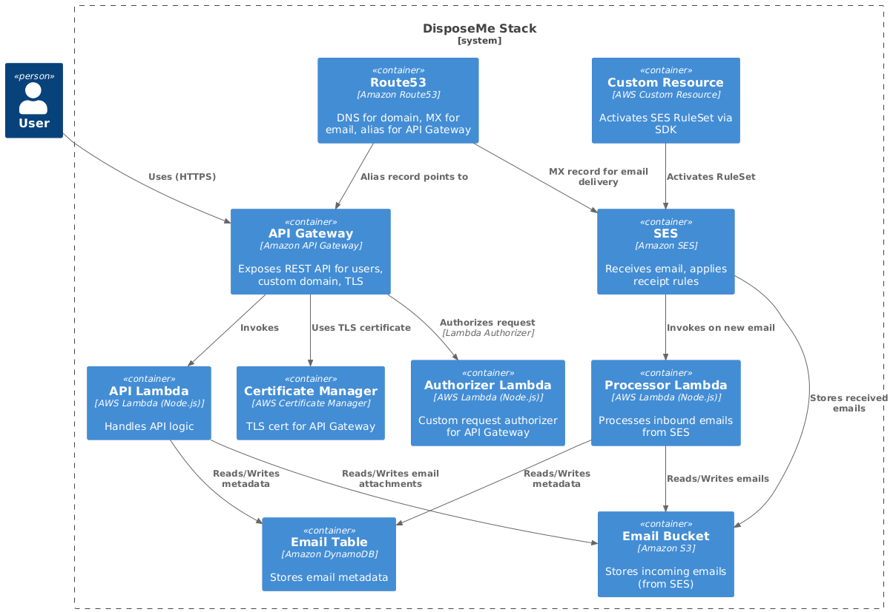

# C4 Diagram: Container Level

## Key Components

- User
- API Gateway (custom domain, usage plan, API Key)
- Lambda Functions:
- API Lambda
  - Authorizer Lambda
  - Processor Lambda
  - DynamoDB Table (for email metadata storage)
- S3 Bucket (for email storage)
- SES (receiving email, identity, rule set)
- Route53 (DNS, MX record, alias for API Gateway)
- Certificate Manager (TLS for API Gateway)
- Custom Resource (SES RuleSet activation)

## C4 Container Diagram



## PlantUML Code for C4 Container Diagram

Copy and paste this into [PlantUML](https://plantuml.com/plantuml/uml/) online server or any PlantUML-enabled tool:

```
@startuml
!includeurl https://raw.githubusercontent.com/plantuml-stdlib/C4-PlantUML/master/C4_Container.puml

Person(user, "User")
System_Boundary(s1, "DisposeMe Stack") {
    Container(apiGw, "API Gateway", "Amazon API Gateway", "Exposes REST API for users, custom domain, TLS")
    Container(lambdaApi, "API Lambda", "AWS Lambda (Node.js)", "Handles API logic")
    Container(lambdaAuthorizer, "Authorizer Lambda", "AWS Lambda (Node.js)", "Custom request authorizer for API Gateway")
    Container(lambdaProcessor, "Processor Lambda", "AWS Lambda (Node.js)", "Processes inbound emails from SES")
    Container(s3, "Email Bucket", "Amazon S3", "Stores incoming emails (from SES)")
    Container(dynamo, "Email Table", "Amazon DynamoDB", "Stores email metadata")
    Container(certManager, "Certificate Manager", "AWS Certificate Manager", "TLS cert for API Gateway")
    Container(route53, "Route53", "Amazon Route53", "DNS for domain, MX for email, alias for API Gateway")
    Container(ses, "SES", "Amazon SES", "Receives email, applies receipt rules")
    Container(customResource, "Custom Resource", "AWS Custom Resource", "Activates SES RuleSet via SDK")
}

Rel(user, apiGw, "Uses (HTTPS)")
Rel(apiGw, lambdaAuthorizer, "Authorizes request", "Lambda Authorizer")
Rel(apiGw, lambdaApi, "Invokes")
Rel(lambdaApi, s3, "Reads/Writes email attachments")
Rel(lambdaApi, dynamo, "Reads/Writes metadata")
Rel(lambdaProcessor, s3, "Reads/Writes emails")
Rel(lambdaProcessor, dynamo, "Reads/Writes metadata")
Rel(ses, s3, "Stores received emails")
Rel(ses, lambdaProcessor, "Invokes on new email")
Rel(apiGw, certManager, "Uses TLS certificate")
Rel(route53, apiGw, "Alias record points to")
Rel(route53, ses, "MX record for email delivery")
Rel(customResource, ses, "Activates RuleSet")
@enduml
```
